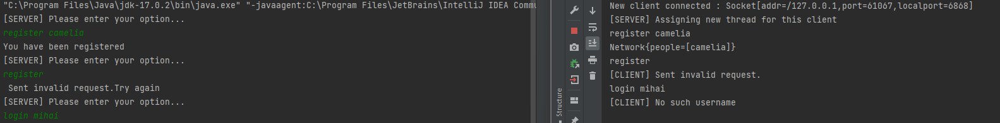
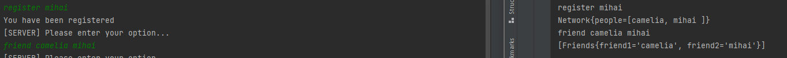

# Networking

Create an application where clients connect to a server in order to form a social network. The application will contain two parts (create a project for each one):

- The server is responsible with the management of the clients and the implementation of the services.
- The client will communicate with the server, sending it commands containing the name of the service and the required parameters. The commands are:
  - register name: adds a new person to the social network;
  - login name: establishes a connection between the server and the client;
  - friend name1 name2 ... namek: adds friendship relations between the person that sends the command and other persons;
  - send message: sends a message to all friends.
  - read: reads the messages from the server.
The main specifications of the application are:

## Compulsory (1p)

- [x] Create the project for the server application.
- [x] Implement the class responsible with the creation of a ServerSocket running at a specified port. The server will receive requests (commands) from clients and it will execute them.
- [x] Create a class that will be responsible with communicating with a client Socket. The communication will be on a separate thread. If the server receives the command stop it will stop and will return to the client the respons "Server stopped", otherwise it return: "Server received the request ... ".
- [x] Create the project for the client application.
- [x] A client will read commands from the keyboard and it will send them to the server. The client stops when it reads from the keyboard the string "exit".

## Homework (2p)

- [x] Create an object-oriented model for your application and implement the commands.
The command stop should "gracefully" stop the server - it will not accept new games but it will finish those in progress. When there are no more games, it will shutdown.
  - I was not able to do all the commands properly. But you can see here that I can register and login and validate the commands

  
  - you can also see the friend command 

  

- [x] Implement a timeout for a connection (a number of minutes). If the server does not receive any command from a logged in client in the specified period of time, it will terminate the connection.

