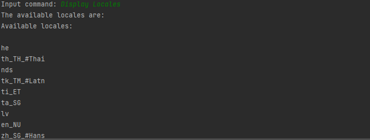
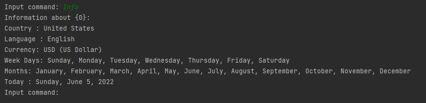
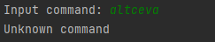

# Internationalization and Localization

Create an application to explore the available locales included in the standard Java Development Kit.

The main specifications of the application are:

## Compulsory (1p)

- [x] Create the files: Messages.properties, Messages_ro.properties
  - [x] #Messages.properties file
prompt = Input command:
locales = The available locales are:
locale.set = The current locale is {0}
info = Information about {0}:
invalid = Unknown command
  - [x] #Messages_ro.properties file
prompt = Comanda ta:
locales = Localizarile disponibile sunt:
locale.set = Localizarea curenta este {0}
info = Informatii despre localizarea {0}:
invalid = Comanda necunoascuta
- [x] Create the package com and implement the following classes describing commands
  - [x] DisplayLocales: to display all available locales
  - [x] SetLocale: to set the application current locale.
  - [x] Info: to display informations about the current or a specific locale.
    - When the user sets a specific language tag, various information obtained using standard Java classes such as Currency or DateFormatSymbols should be displayed in a text area, as in the following example:
      - [x] Country: Romania (Romania)
      - [x] Language: Romanian (romana)
      - [x] Currency: RON (Romanian Leu)
      - [x] Week Days: luni, marti, miercuri, joi, vineri, sambata, duminica
      - [x] Months: ianuarie, februarie, martie, aprilie, mai, iunie, iulie, august, septembrie, octombrie, noiembrie, decembrie
      - [x] Today: May 8, 2016 (8 mai 2016)
- [x] Create the package app and the main class LocaleExplore. Inside this class, read commands from the keyboard and execute them.
- [x] All the locale-sensitive information should be translated in at least two languages (english-default and romanian), using the resource files.

Some examples of commands:

- 
- 
- 

