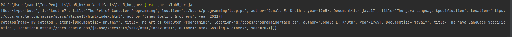

# Bibliography Management System

Write an application that can manage a catalog of resources (bibliographic references), such as books, articles, etc.
These resources might be represented by files in the local file system or a Web address. Apart from a unique identifier, a title and its location, a resource may have additional properties such as author(s), what year it was publihsed, description, etc.
You may read more about reference management software, see a comparison of notable implementations, such as JabRef.

## Compulsory 

- [x] Create an object-oriented model of the problem. You should have at least the following classes: Catalog and Item. The items should have at least a unique identifier, a title and its location. Consider using an interface or an abstract class in order to describe the items in a catalog..
- [x] Implement the following methods representing commands that will manage the content of the catalog:
      - [x] add: adds a new entry into the catalog;
      - [x] toString: a textual representation of the catalog;
      - [x] save: saves the catalog to an external file using JSON format; you may use Jackson or other library;
      - [x] load: loads the catalog from an external file.
## Homework

- [x] Represent the commands using classes instead of methods. Use an interface or an abstract class in order to desribe a generic command. Implement the commands load, list, view, report (create the classes AddCommand, ListCommand, etc.).
      - [x] list: prints the list of items on the screen;
      - [x] view: opens an item using the native operating system application (see the Desktop class);
      - [x] report: creates (and opens) an HTML report representing the content of the catalog.
      - 
- [x] The application will signal invalid date or the commands that are not valid using custom exceptions.
- [x] The final form of the application will be an executable JAR archive. Identify the generated archive and launch the application from the console, using the JAR.
      - I used [this](https://stackoverflow.com/questions/1082580/how-to-build-jars-from-intellij-properly/45303637#45303637) in order to help me
      - Here is a screenshot to prove that I did this task 
      