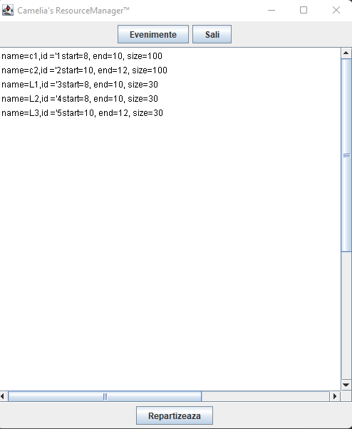
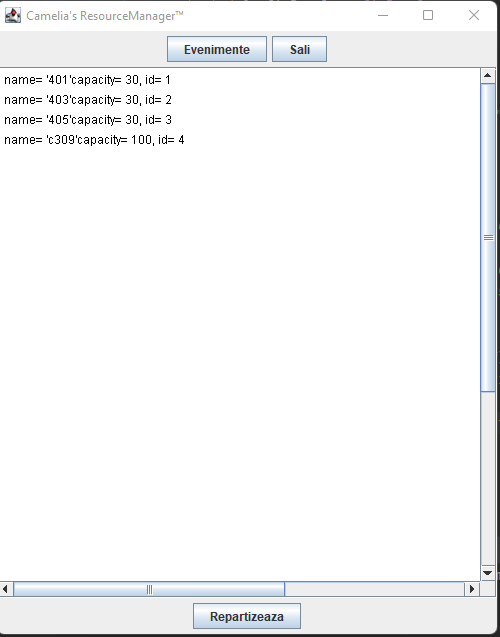
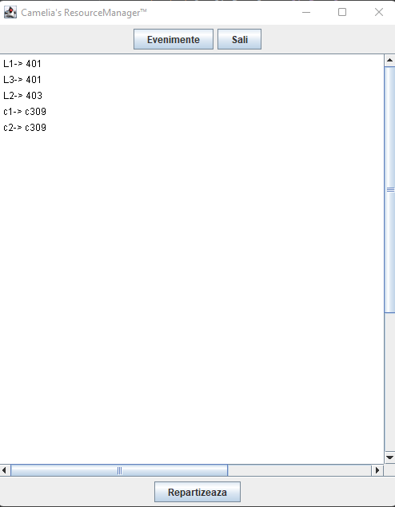

# UniversityResources (in Romanian)

Evidenta salilor/resurselor unei universitati [Repartizarea eficienta a evenimentelor din orar - Graph Coloring Applications]

## Explanation and screenshots
My application has:

- [x] a database that I use to get the events and rooms available
- [x] an interface
- [x] a correctly implemented OOP model (hopefully)
- [x] an algorithm part 

To get a better understanding of how my project works here are some explanations with screenshots:

  

  - Here is a picture of the app when I click the "Evenimente" button. It lists all the events and their information (that I take from the db)
  
  

  - In this screenshot you can see what happens when I click the "Sali" buttons). I also take theese from the database

  

  - Lastly, when I click the "Repartizeaza" button, you can see the events and the rooms they were allocated to. The algorith behind this you can find in the "Repartizare" class. As I said in my presentation, I have a string matrix of [#rooms][24]. I itterate through the events and the rooms and verify that the i event has a smaller size than the capacity of j room. If that is true, I verify that the room is available at the needed hours. In case both of these conditions are true, I allocate the event to the room.  

      